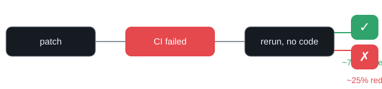

# 🔄 rerun-to-green

**How many failed CI runs go green on a bare rerun — no code change?**

Measured on **143,061 public GitHub Actions runs** from 32 open-source repositories.

> Every number here was measured on public data (2026-08-19). No estimates, no marketing — just data. 🧪

---

## The question

Every developer knows the reflex:

> CI is red. Nothing in my diff is wrong. Let me just **rerun** it.

How often does that actually work? How often does a failed run turn green on the
exact same commit, without anyone writing a single line of code?

We measured it.

## The number

> Of the runs GitHub recorded as **re-runs on a failed first attempt**, **~75% finished green** —
> same commit, same workflow, zero code change.

And the other side of the coin:

> Only **~18% of failed runs ever get a same-commit re-run**. Most red runs are "fixed"
> with a new commit — but the re-runs that happen turn green 3 out of 4 times.



## How we measured

1. Downloaded **workflow-run metadata** for 32 public repos via the GitHub API.
2. Grouped runs by `(repository, workflow, commit SHA)`.
3. Found episodes that started **red** (failure/timed_out).
4. Checked whether a later run of the **exact same commit** finished **green**.
5. Separately validated the "press rerun" case: for runs with `run_attempt ≥ 2`,
   we fetched attempt #1 to confirm it genuinely failed.

No source code. No logs. No user data. Public metadata only.

| Dataset | Value |
|---|---|
| Repositories | 32 |
| Workflow runs | 143,061 |
| Failed-run episodes | 10,047 |
| Same-commit re-run episodes | 1,785 |
| Re-runs on a failed first attempt (sampled) | 400 (83 validated) |

## Results

| Metric | Value |
|---|---|
| Failed runs re-run on the same commit | ~18% |
| ...of which turned green (entry-level) | ~28% |
| ...of which turned green when *you press rerun* (attempt-level) | ~75% |
| Median time-to-green (recovered) | ~4 min |
| P90 time-to-green (recovered) | ~2.9 h |

## What this does and does not mean

- **Green after rerun ≠ the code is correct.** It means the failure wasn't caused by
  your commit — usually a flaky test, network, or environment issue.
- **This is not "AI causes this".** We don't know which runs were AI-written and we
  don't claim to. The recovery loop costs time regardless of who wrote the code.
- **Selection bias:** developers re-run runs they *suspect* are flaky, so the ~75% is
  conditional on a developer choosing to rerun.
- **Snapshot:** data covers up to 90 days (2026) for 32 curated repos. Heavy repos
  were capped at the 6,000 most recent runs.

## The point

AI coding tools are often measured by *how fast a patch is written*.
But a patch isn't "done" when it's written — it's done when CI is green.

This repo measures that hidden loop: **the time between "red" and "green"** that
nobody counts, on the exact same code.

> AI writes the patch. CI decides whether it's usable.

## Reproduce

```bash
# 1. fetch workflow-run metadata (needs a GitHub token for rate limits)
GH_TOKEN=<token> WINDOW_DAYS=90 python3 src/fetch_runs.py

# 2. analyze into episodes and headline numbers
python3 src/analyze.py

# 3. optional: validate the attempt-based rerun rate on a sample
python3 src/validate_attempts.py
```

Raw data is in `data/raw/`, results in `data/processed/`.

## Details

- [`docs/en/01-methodology.md`](docs/en/01-methodology.md) — how the data was collected
- [`docs/en/02-results.md`](docs/en/02-results.md) — the numbers, per repo and per event type
- [`docs/en/03-limitations.md`](docs/en/03-limitations.md) — honest limits

## License

MIT
