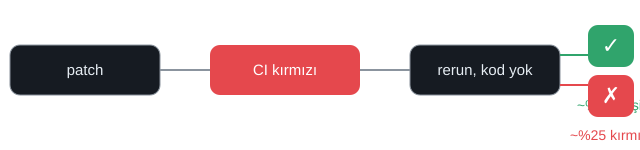

# 🔄 rerun-to-green

[🇬🇧 English](README.md) · **Türkçe**

**Kaç başarısız CI koşusu sırf yeniden çalıştırınca yeşile dönüyor — kod değişmeden?**

32 açık kaynak repodaki **143.061 public GitHub Actions koşusu** üzerinde ölçüldü.

> Buradaki her sayı public veri üzerinde ölçüldü (2026-08-19). Tahmin yok, pazarlama yok — sadece veri. 🧪

---

## Soru

Her geliştiricinin bildiği refleks:

> CI kırmızı. Diff'imde hata yok. Hadi bir **daha basayım**.

Bu gerçekte ne kadar işe yarıyor? Başarısız bir koşu, aynı commit'te — kimse tek satır
kod yazmadan — ne kadar sıklıkla yeşile dönüyor?

Ölçtük.

## Sayı

> GitHub'ın **başarısız ilk denemede yeniden çalıştırıldığını** kaydettiği koşuların
> **~%75'i yeşile döndü** — aynı commit, aynı workflow, sıfır kod değişikliği.

Diğer tarafı da var:

> Başarısız koşuların yalnızca **~%18'i aynı commit'te yeniden çalıştırılıyor**.
> Çoğu kırmızı koşu yeni commit ile "düzeltiliyor" — ama yapılan yeniden çalıştırmaların
> 4'te 3'ü yeşile dönüyor.



## Nasıl ölçtük

1. GitHub API ile 32 public reponun **workflow-run metadata'sını** indirdik.
2. Koşuları `(repo, workflow, commit SHA)` ile grupladık.
3. **Kırmızı** (failure/timed_out) başlayan bölümleri bulduk.
4. Aynı commit'in sonraki bir koşusunun **yeşile** dönüp dönmediğini kontrol ettik.
5. Ayrıca "rerun butonuna basma" durumunu doğruladık: `run_attempt ≥ 2` olan koşularda
   attempt #1'i çekip gerçekten başarısız olduğunu teyit ettik.

Kaynak kod yok. Log yok. Kullanıcı verisi yok. Sadece public metadata.

| Veri seti | Değer |
|---|---|
| Repo | 32 |
| Workflow koşusu | 143.061 |
| Başarısız koşu bölümü | 10.047 |
| Aynı commit'te yeniden çalıştırılan bölüm | 1.785 |
| Başarısız ilk denemede yeniden çalıştırılan (örneklem) | 400 (83 doğrulandı) |

## Sonuçlar

| Metrik | Değer |
|---|---|
| Aynı commit'te yeniden çalıştırılan başarısız koşu | ~%18 |
| ...bunlardan yeşile dönen (entry bazlı) | ~%28 |
| ...*sen rerun'a basınca* yeşile dönen (attempt bazlı) | ~%75 |
| Yeşile dönme süresi medyan (iyileşenler) | ~4 dk |
| Yeşile dönme süresi P90 (iyileşenler) | ~2,9 sa |

## Bu ne demek, ne demek değil

- **Rerun sonrası yeşil ≠ kod doğru.** Failure'ın commit'inden kaynaklanmadığı anlamına
  gelir — genelde flaky test, network veya environment sorunu.
- **Bu "AI bunun sebebi" demek değil.** Hangi koşuların AI ile yazıldığını bilmiyoruz ve
  iddia da etmiyoruz. Recovery döngüsü kodu kim yazarsa yazsın zaman alıyor.
- **Seçim yanlılığı:** geliştiriciler genelde *flaky olduğundan şüphelendikleri* koşuları
  yeniden çalıştırır; yani ~%75, "geliştirici rerun yapmayı seçti" koşuluna bağlı.
- **Anlık görüntü:** veri 90 güne kadar (2026) ve 32 seçili repoyu kapsıyor. Yoğun
  repolarda en yeni 6.000 koşu limiti uygulandı.

## Mesele

AI coding araçları genelde *patch ne kadar hızlı yazıldı* ile ölçülüyor.
Ama bir patch yazıldığında "bitmiş" olmaz — CI yeşil olduğunda biter.

Bu repo o görünmeyen döngüyü ölçüyor: **"kırmızı" ile "yeşil" arasındaki süre** —
kimsenin saymadığı, aynı kod üzerindeki süre.

> AI patch'i yazar. Kullanılabilir olup olmadığına CI karar verir.

## Yeniden üret

```bash
# 1. workflow-run metadata'sını çek (rate limit için GitHub token gerekir)
GH_TOKEN=<token> WINDOW_DAYS=90 python3 src/fetch_runs.py

# 2. episode'lara ve başlık sayılarına analiz et
python3 src/analyze.py

# 3. isteğe bağlı: attempt bazlı rerun oranını örneklemle doğrula
python3 src/validate_attempts.py
```

Ham veri `data/raw/`, sonuçlar `data/processed/`.

## Detaylar

- [`docs/tr/01-yontem.md`](docs/tr/01-yontem.md) — veri nasıl toplandı
- [`docs/tr/02-sonuclar.md`](docs/tr/02-sonuclar.md) — sayılar, repo ve olay türüne göre
- [`docs/tr/03-sinirlar.md`](docs/tr/03-sinirlar.md) — dürüst sınırlar

## Lisans

MIT
